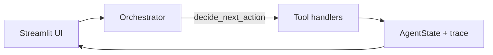

# WarungFlow

**OpenClaw2026_MuhammadAldoFahrezy_WarungFlow** — autonomous finance operations agent for Indonesian UMKM (OpenClaw Agenthon Indonesia 2026, **Best Payment Use Case**).

**Tagline:** From messy notes to bankable reports, autonomously.

| | |
|---|---|
| **Team** | OpenClaw2026_MuhammadAldoFahrezy |
| **Devpost** | https://openclawagenthon.devpost.com/ |
| **Live demo (VPS)** | http://43.157.208.68:8501 |
| **GitHub** | https://github.com/aldofahrezy/Warung-Flow |

---

## What it does

WarungFlow is **not a chatbot**. It is a state-driven autonomous agent that:

1. Loads messy WhatsApp-style orders, QRIS/bank payments, expenses, and a product catalogue.
2. Parses orders (deterministic + catalogue pricing) and reconciles payments with fuzzy Indonesian name matching and **order-ID priority** in bank notes.
3. Flags **PAID**, **UNPAID**, **PARTIALLY_PAID**, **OVERPAID**, and **NEEDS_REVIEW** — with **Sisa Rp …** / **Lebih Rp …** in the UI.
4. Optionally creates mock or DOKU Sandbox payment requests (mock mode works without API keys).
5. Calculates cashflow, net profit, and a 0–100 health score.
6. Generates Bahasa Indonesia payment reminders and financing-readiness text.
7. Validates and exports markdown/CSV reports.

**Reactive demo:** the Live Data Sandbox lets you add orders, payments, and expenses; with auto-refresh on, the agent reruns when input data changes (e.g. Kevin UNPAID → PAID).

---

## Streamlit dashboard (merchant-friendly UI)

Navigation (`app.py`):

| Page | Purpose |
|------|---------|
| **Beranda** | KPIs, reconciliation summary, **Langkah yang disarankan**, export downloads, agent trace at bottom |
| **Katalog** | Product CRUD (add/edit/delete), CSV import/export, stock warnings |
| **WhatsApp Bot** | Mock customer chat, order table, payment simulation (no raw URLs/tokens on main view) |
| **Jejak agen** | Human-readable execution trace grouped by `run_id` |
| **Rekonsiliasi** | Tagihan / Terbayar / Status / Sisa-kelebihan tables (technical columns in expander) |
| **Laporan** | Altair charts, KPIs, recommendations, report downloads |

**Sidebar:** Live Data Sandbox (orders, payments, expenses), auto-refresh toggle, **Force Refresh Analysis**, **Reset Demo**, mock-mode banner.

Shared UI helpers live in `dashboard.py` (`section_header_html`, `build_action_recommendations`, `reconciliation_table_html`, etc.).

---

## WhatsApp bot (optional)

- **`bot_server.py`** — FastAPI webhook + mock chat API (`WHATSAPP_MODE=mock` by default).
- **`tools/bot_service.py`**, **`tools/event_store.py`**, **`tools/whatsapp_provider.py`** — order intake, catalogue matching, mock payment links.
- Dashboard **WhatsApp Bot** page drives the demo without exposing uvicorn URLs or secrets on the main UI.

Configure via `.env` (see `.env.example`): `WHATSAPP_*`, `BOT_SERVER_URL`, `PUBLIC_BASE_URL`.

---

## Product catalogue

- Data: `data/product_catalogue.csv`
- Tools: `tools/catalogue_tools.py` (load, match, upsert, delete)
- Agent tool: `LOAD_PRODUCT_CATALOGUE` (pricing for parsed orders)
- Dashboard: full CRUD on **Katalog** + CSV import tab

---

## Quick start (judges)

```bash
git clone https://github.com/aldofahrezy/Warung-Flow.git
cd Warung-Flow
python3 -m venv .venv
source .venv/bin/activate
pip install -r requirements.txt
cp .env.example .env    # mock modes — no API keys required
python smoke_test.py -v
streamlit run app.py
```

Open http://localhost:8501 — sample **Warung Bu Sari** data loads and the first agent run starts automatically.

**Optional bot server** (separate terminal):

```bash
uvicorn bot_server:app --host 0.0.0.0 --port 8000
```

---

## Agent architecture



- **Loop:** `agents/orchestrator.py` — `run_agent_stream()`, max **24** steps per run, `payment_status_poll_done` prevents infinite `CHECK_PAYMENT_STATUS` loops.
- **State:** `state.py` — `AgentState`, `execution_trace`, payment request maps, sandbox fingerprints.
- **Tools:** `agents/tool_handlers.py` — `TOOL_REGISTRY` (20 handlers).
- **Logic:** `tools/` — parsers, reconciliation, cashflow, mock/DOKU payment provider, catalogue, bot.

Workspace docs for OpenClaw/QwenPaw: `workspace/AGENTS.md`, `SOUL.md`, `TOOLS.md`, `HEARTBEAT.md`, `MEMORY.md`, `PROFILE.md`.

---

## Tool registry

| Tool | Role |
|------|------|
| `LOAD_MERCHANT_PROFILE` | Merchant JSON |
| `LOAD_PRODUCT_CATALOGUE` | Product prices for parsing |
| `SYNC_BOT_EVENTS` | Merge WhatsApp bot orders into state |
| `LOAD_ORDERS` / `PARSE_ORDERS` | Raw → structured orders |
| `ESTIMATE_OR_FLAG_UNKNOWN_AMOUNTS` | Catalogue-based estimates |
| `LOAD_PAYMENTS` / `LOAD_EXPENSES` / `LOAD_CUSTOMERS` | Inputs |
| `RECONCILE_PAYMENTS` | Match orders ↔ payments |
| `DETECT_PAYMENT_ISSUES` | UNPAID / partial / overpaid |
| `RESOLVE_PAYMENT_REQUESTS` | Create payment links (mock/DOKU) |
| `CHECK_PAYMENT_STATUS` | Poll provider (once per run) |
| `SIMULATE_DOKU_WEBHOOK` | Sandbox webhook demo |
| `CALCULATE_CASHFLOW` / `SCORE_CASHFLOW_HEALTH` | P&L + health score |
| `GENERATE_REMINDERS` / `GENERATE_FINANCING_READINESS` / `GENERATE_DAILY_REPORT` | Advisor outputs |
| `VALIDATE_OUTPUTS` / `EXPORT_REPORTS` | QA + files under `outputs/` |

---

## Configuration

| Variable | Default | Notes |
|----------|---------|--------|
| `PAYMENT_MODE` | `mock` | `mock` or `doku` |
| `LLM_MODE` | `mock` | `mock` or `live` (Groq optional) |
| `WHATSAPP_MODE` | `mock` | `mock` or `live` (Meta API) |
| `WARUNGFLOW_ENV` | `local` | `production` on deploy |

See `.env.example` for DOKU and WhatsApp fields.

---

## Sample data

| File | Content |
|------|---------|
| `data/sample_whatsapp_orders.txt` | 10 messy orders (Warung Bu Sari) |
| `data/sample_qris_transactions.csv` | QRIS-style payments |
| `data/sample_expenses.csv` | Daily expenses |
| `data/sample_customers.csv` | CRM names |
| `data/product_catalogue.csv` | Menu + prices |
| `data/merchant_profile.json` | Store metadata |

---

## Tests & outputs

```bash
python smoke_test.py -v
```

Covers reconciliation, payment poll guard, catalogue CRUD, recommendations, and full agent run. Generated artifacts (gitignored except `outputs/example_outputs.md`):

- `daily_report.md`, `payment_reminders.md`, `financing_readiness.md`, `validation_report.md`
- `reconciliation_result.csv`, `execution_trace.csv`

---

## Deploy

- **VPS (current live):** http://43.157.208.68:8501 — see `DEPLOY.md` and `deploy/warungflow.service`
- **Streamlit Cloud:** `DEPLOY.md` → `https://warungflow-muhammadaldofahrezy.streamlit.app`

---

## Submission docs

| Doc | Use |
|-----|-----|
| `SUBMISSION.md` | Devpost checklist |
| `docs/devpost_submission.md` | Copy-paste Devpost fields |
| `docs/demo_script.md` | 2-minute video script |
| `docs/OpenClaw2026_MuhammadAldoFahrezy_WarungFlow.md` | Pitch deck source |

---

## License

MIT — see repository for details.
