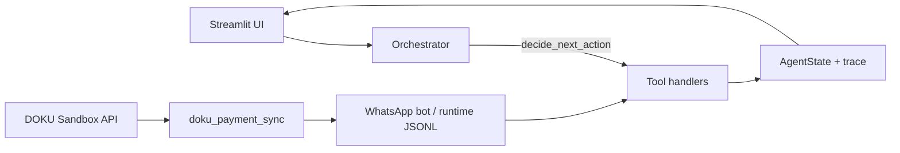

# WarungFlow

**OpenClaw2026_MuhammadAldoFahrezy_WarungFlow** — autonomous finance operations agent for Indonesian UMKM (OpenClaw Agenthon Indonesia 2026, **Best Payment Use Case**).

**Tagline:** From messy notes to bankable reports, autonomously.

| | |
|---|---|
| **Team** | OpenClaw2026_MuhammadAldoFahrezy |
| **Devpost** | https://openclawagenthon.devpost.com/ |
| **Live demo (VPS)** | http://43.157.208.68:8501 |
| **GitHub** | https://github.com/aldofahrezy/Warung-Flow |

---

## What it does

WarungFlow is **not a chatbot**. It is a state-driven autonomous agent that:

1. Loads messy WhatsApp-style orders, QRIS/bank payments, expenses, and a product catalogue.
2. Parses orders (deterministic + catalogue pricing) and reconciles payments with fuzzy Indonesian name matching and **order-ID priority** in bank notes.
3. Flags **PAID**, **UNPAID**, **PARTIALLY_PAID**, **OVERPAID**, and **NEEDS_REVIEW** — with **Sisa Rp …** / **Lebih Rp …** in the UI.
4. Creates payment requests in **Mock mode** (no API keys) or **DOKU Sandbox** (hosted checkout + status sync).
5. Calculates cashflow, net profit, and a 0–100 health score.
6. Generates Bahasa Indonesia payment reminders and financing-readiness text.
7. Validates and exports markdown/CSV reports.

**Reactive demo:** add orders, payments, and expenses on **Simulasi**; with auto-refresh on, the agent reruns when input data changes (e.g. Kevin UNPAID → PAID).

---

## Judge testing (start here)

Detailed step-by-step flows for both payment modes:

| Guide | Content |
|-------|---------|
| **[docs/judge_testing_guide.md](docs/judge_testing_guide.md)** | Full judge walkthrough (Mock + DOKU Sandbox) |
| **[docs/demo_script.md](docs/demo_script.md)** | 2-minute video shot list |

### Quick path — Mock mode (~8 min, no API keys)

```bash
cp .env.example .env
python smoke_test.py -v
streamlit run app.py
```

1. Open http://localhost:8501 — first agent run starts automatically.
2. **Simulasi** → **Mode pembayaran** = **Mock (demo aman)**.
3. **Pesanan WhatsApp** → send `nasi goreng 2 - Kevin` → see bot reply and **Pesanan dari bot**.
4. Pay via link `?mock_pay=ORD-BOT-xxxxx` in the chat, or **Tandai sudah bayar** on Simulasi.
5. **Beranda** / **Rekonsiliasi** → order **Lunas**; **Jejak agen** shows tool trace.

### Quick path — DOKU Sandbox (~12 min, needs sandbox keys)

1. Add to `.env`: `DOKU_CLIENT_ID`, `DOKU_SECRET_KEY`, `PUBLIC_BASE_URL=http://localhost:8501`.
2. **Simulasi** → **Mode pembayaran** = **DOKU Sandbox** (caption must show `kredensial DOKU OK`).
3. Place order via WhatsApp tab → open **checkout DOKU** link from bot message.
4. Complete payment on https://staging.doku.com.
5. Open WarungFlow simulator link `/?doku_pay=ORD-BOT-xxxxx` → **↻ Cek status pembayaran DOKU**.
6. Confirm **Pesanan dari bot** shows **Lunas**.

> Pembayaran di halaman DOKU tidak mengubah dashboard sampai WarungFlow mem-poll API Check Status (`tools/doku_payment_sync.py`). Ini disengaja untuk demo integrasi payment gateway nyata.

---

## Streamlit dashboard

Navigation (`app.py`):

| Page | Purpose |
|------|---------|
| **Beranda** | KPIs, reconciliation summary, **Langkah yang disarankan**, export downloads, agent trace |
| **Simulasi** | WhatsApp chat (rooms per phone), bot orders, QRIS payments, expenses, **payment mode**, auto-refresh |
| **Katalog** | Product CRUD, CSV import/export, stock warnings |
| **Jejak agen** | Human-readable execution trace grouped by `run_id` |
| **Rekonsiliasi** | Tagihan / Terbayar / Status / Sisa-kelebihan tables |
| **Laporan** | Altair charts, KPIs, recommendations, report downloads |

**Sidebar:** navigation, **Reset riwayat demo** (clears `runtime/` bot chat + orders).

**Deep links (payment):**

| Query param | Behavior |
|-------------|----------|
| `?mock_pay=ORD-BOT-xxxxx` | Record mock payment, refresh reconciliation |
| `?doku_pay=ORD-BOT-xxxxx` | DOKU simulator page (checkout link + status poll) |
| `?doku_return=ORD-BOT-xxxxx` | Return from DOKU hosted checkout → auto status sync |

Session state (including payment mode choice) persists across refresh via `runtime/ui_session_snapshot.json`. Use **Reset riwayat demo** for a clean bot/payment trial.

---

## Payment modes

Mode is selected in the UI (**Simulasi → Mode pembayaran**), not via `PAYMENT_MODE` env.

| UI choice | Credentials | Customer experience |
|-----------|-------------|---------------------|
| **mock** | None | Link `?mock_pay=ORD-BOT-xxx` — instant simulated pay |
| **doku_sandbox** | `DOKU_CLIENT_ID` + `DOKU_SECRET_KEY` | DOKU hosted checkout on `staging.doku.com` + WarungFlow simulator; status via Check Status API |

If DOKU is selected but credentials are missing, the app **falls back to mock** and shows a warning.

**Modules:**

- `tools/payment_links.py` — build payment_request for bot orders
- `tools/mock_payment_provider.py` — mock provider for agent tools
- `tools/doku_sandbox_provider.py` — DOKU Checkout POST + Check Status GET
- `tools/doku_payment_sync.py` — poll DOKU → update bot order to PAID
- `dashboard_doku_checkout.py` — Streamlit pages for `doku_pay` / `doku_return`

---

## WhatsApp bot

- **`bot_server.py`** — FastAPI webhook + mock chat API (`WHATSAPP_MODE=mock` by default).
- **`tools/bot_service.py`**, **`tools/event_store.py`**, **`tools/whatsapp_provider.py`** — order intake, catalogue matching, payment links.
- **Simulasi** page: structured form or plain chat text; one chat room per phone number.

Configure via `.env` (see `.env.example`): `WHATSAPP_*`, `BOT_SERVER_URL`, `PUBLIC_BASE_URL`.

---

## Product catalogue

- Data: `data/product_catalogue.csv`
- Tools: `tools/catalogue_tools.py` (load, match, upsert, delete)
- Agent tool: `LOAD_PRODUCT_CATALOGUE`
- Dashboard: full CRUD on **Katalog** + CSV import tab

---

## Quick start (developers & judges)

```bash
git clone https://github.com/aldofahrezy/Warung-Flow.git
cd Warung-Flow
python3 -m venv .venv
source .venv/bin/activate
pip install -r requirements.txt
cp .env.example .env    # mock mode works without API keys
python smoke_test.py -v
streamlit run app.py
```

Open http://localhost:8501 — sample **Warung Bu Sari** data loads and the first agent run starts automatically.

**Optional bot server** (separate terminal):

```bash
uvicorn bot_server:app --host 0.0.0.0 --port 8000
```

---

## Agent architecture



- **Loop:** `agents/orchestrator.py` — `run_agent_stream()`, max **24** steps per run, `payment_status_poll_done` prevents infinite `CHECK_PAYMENT_STATUS` loops.
- **State:** `state.py` — `AgentState`, `execution_trace`, payment request maps, sandbox fingerprints.
- **Tools:** `agents/tool_handlers.py` — `TOOL_REGISTRY` (20 handlers).
- **Logic:** `tools/` — parsers, reconciliation, cashflow, mock/DOKU payment, catalogue, bot.

Workspace docs for OpenClaw/QwenPaw: `workspace/AGENTS.md`, `SOUL.md`, `TOOLS.md`, `HEARTBEAT.md`, `MEMORY.md`, `PROFILE.md`.

---

## Tool registry

| Tool | Role |
|------|------|
| `LOAD_MERCHANT_PROFILE` | Merchant JSON |
| `LOAD_PRODUCT_CATALOGUE` | Product prices for parsing |
| `SYNC_BOT_EVENTS` | Merge WhatsApp bot orders into state |
| `LOAD_ORDERS` / `PARSE_ORDERS` | Raw → structured orders |
| `ESTIMATE_OR_FLAG_UNKNOWN_AMOUNTS` | Catalogue-based estimates |
| `LOAD_PAYMENTS` / `LOAD_EXPENSES` / `LOAD_CUSTOMERS` | Inputs |
| `RECONCILE_PAYMENTS` | Match orders ↔ payments |
| `DETECT_PAYMENT_ISSUES` | UNPAID / partial / overpaid |
| `RESOLVE_PAYMENT_REQUESTS` | Create payment links (mock/DOKU) |
| `CHECK_PAYMENT_STATUS` | Poll provider (once per run) |
| `SIMULATE_DOKU_WEBHOOK` | Sandbox webhook demo |
| `CALCULATE_CASHFLOW` / `SCORE_CASHFLOW_HEALTH` | P&L + health score |
| `GENERATE_REMINDERS` / `GENERATE_FINANCING_READINESS` / `GENERATE_DAILY_REPORT` | Advisor outputs |
| `VALIDATE_OUTPUTS` / `EXPORT_REPORTS` | QA + files under `outputs/` |

---

## Configuration

| Variable | Notes |
|----------|--------|
| `WARUNGFLOW_ENV` | `local` or `production` (banner on live deploy) |
| `LLM_MODE` | `mock` or `live` (Groq/OpenAI/Gemini optional) |
| `DOKU_CLIENT_ID` / `DOKU_SECRET_KEY` | Required for DOKU Sandbox UI mode |
| `PUBLIC_BASE_URL` | Base URL for `mock_pay` / `doku_pay` links (set to live URL on VPS) |
| `WHATSAPP_MODE` | `mock` (default) or live Meta API |
| ~~`PAYMENT_MODE`~~ | **Not used** — select mode in Simulasi UI |

See `.env.example` for all fields.

---

## Sample data

| File | Content |
|------|---------|
| `data/sample_whatsapp_orders.txt` | 10 messy orders (Warung Bu Sari) |
| `data/sample_qris_transactions.csv` | QRIS-style payments |
| `data/sample_expenses.csv` | Daily expenses |
| `data/sample_customers.csv` | CRM names |
| `data/product_catalogue.csv` | Menu + prices |
| `data/merchant_profile.json` | Store metadata |

Runtime (gitignored): `runtime/orders.jsonl`, `payments.jsonl`, `events.jsonl`, `ui_session_snapshot.json`.

---

## Tests & outputs

```bash
python smoke_test.py -v
```

Covers reconciliation, payment poll guard, catalogue CRUD, mock/DOKU payment links, bot flow, and full agent run.

Generated artifacts (gitignored except `outputs/example_outputs.md`):

- `daily_report.md`, `payment_reminders.md`, `financing_readiness.md`, `validation_report.md`
- `reconciliation_result.csv`, `execution_trace.csv`

---

## Deploy

- **VPS (current live):** http://43.157.208.68:8501 — see [DEPLOY.md](DEPLOY.md) and `deploy/warungflow.service`
- **Streamlit Cloud:** [DEPLOY.md](DEPLOY.md) → optional `https://warungflow-muhammadaldofahrezy.streamlit.app` (Mock mode recommended)

---

## Submission docs

| Doc | Use |
|-----|-----|
| [SUBMISSION.md](SUBMISSION.md) | Devpost checklist |
| [docs/devpost_submission.md](docs/devpost_submission.md) | Copy-paste Devpost fields |
| [docs/demo_script.md](docs/demo_script.md) | 2-minute video script |
| [docs/judge_testing_guide.md](docs/judge_testing_guide.md) | Judge walkthrough (Mock + DOKU) |
| [docs/OpenClaw2026_MuhammadAldoFahrezy_WarungFlow.md](docs/OpenClaw2026_MuhammadAldoFahrezy_WarungFlow.md) | Pitch deck source |

---

## License

MIT — see repository for details.
