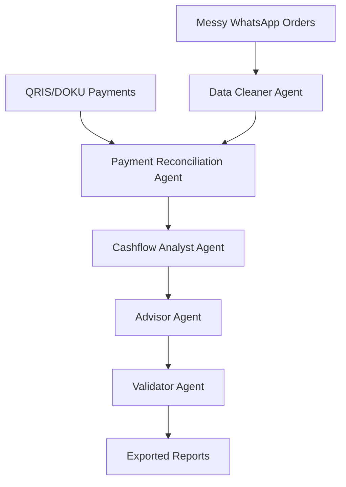

# WarungFlow
**Autonomous finance operations agent for Indonesian UMKM.**

## Problem Statement
Many Indonesian UMKM and warung owners receive orders through WhatsApp, accept payments through QRIS/bank transfer/cash, and track expenses manually. At the end of the day, they often do not know which customers have paid, which payments are partial, how much revenue came in, or what action they should take next. The manual process of matching WhatsApp chats to bank mutations is slow and error-prone.

## Solution Overview
WarungFlow solves this by acting as an autonomous finance operations agent. It parses messy order messages, reconciles payments deterministically, detects unpaid/partial payments, calculates daily cashflow, scores the business health, and even generates DOKU Sandbox payment links for unpaid orders.

## Why this matters for Indonesian UMKM
UMKMs are the backbone of the Indonesian economy. Giving them an autonomous financial assistant allows them to collect unpaid revenue without spending hours on bookkeeping. It bridges the gap between informal digital commerce and formal financial readiness.

## Why this is not a chatbot
WarungFlow is NOT a chatbot. It does not wait for a user's prompt. When triggered, it enters a `while` loop, autonomously deciding which tool to call based on the current state. It possesses memory, tool-calling capabilities ("tangan"), and an execution trace that clearly documents its reasoning and actions.

## Agent Workflow & Autonomous Loop
The agent runs in a continuous heartbeat loop:
1. Observe current state.
2. Decide next required action.
3. Call the correct tool.
4. Update state.
5. Validate progress and continue until the task is complete.



## Tool Call Architecture
WarungFlow utilizes multiple deterministic tools (e.g. `parse_orders_tool`, `reconcile_payments_tool`, `doku_create_payment_request_tool`). Each tool modifies the central `AgentState` object, driving the state machine forward.

## DOKU Sandbox Integration
We integrated the DOKU Sandbox API to dynamically generate payment links when the agent identifies an unpaid order. It falls back gracefully to a Mock Mode if credentials are not configured in `.env`.

## Tech Stack
- Python
- Streamlit
- Pandas
- Pydantic
- python-dotenv
- RapidFuzz

## Installation

1. Create and activate a virtual environment:
```bash
python3 -m venv .venv
source .venv/bin/activate
```

2. Install dependencies:
```bash
pip install -r requirements.txt
```

3. Setup environment variables:
```bash
cp .env.example .env
```

## Environment Variables
Edit `.env` and add:
```
DOKU_CLIENT_ID=dk_********1234
DOKU_SECRET_KEY=SK-********
DOKU_SANDBOX_BASE_URL=https://api-sandbox.doku.com
DOKU_WEBHOOK_SECRET=WH-********
DOKU_ENV=sandbox
```

## How to run
Run the Streamlit app:
```bash
streamlit run app.py
```

## How to use sample data
The `data/` directory contains sample data for Warung Bu Sari:
- `sample_orders_whatsapp.txt`
- `sample_qris_transactions.csv`
- `sample_expenses.csv`
- `merchant_profile.json`

The agent automatically loads this data during its first loop iteration.

## Demo Scenario
1. Open the UI.
2. Select Mock Mode or DOKU Sandbox Mode.
3. Click **Run WarungFlow Agent**.
4. Watch the agent parse WhatsApp messages, reconcile payments, flag unpaid orders, calculate health score, and export reports autonomously.

## Screenshots

*(Placeholder for screenshot)*

## Known limitations
- Currently processes local files instead of live WhatsApp webhooks.
- DOKU Sandbox integration is currently for testing and is not connected to live banking networks.

## Future development
- WhatsApp Business API integration for live order parsing.
- Real-time QRIS/DOKU webhook syncing.
- Expansion to POS integration.
- Direct lending/micro-financing application pipeline for banks.

## AI tools/models used
- Gemini was used for code generation, structuring the agent loop, and creating dummy data representations.
