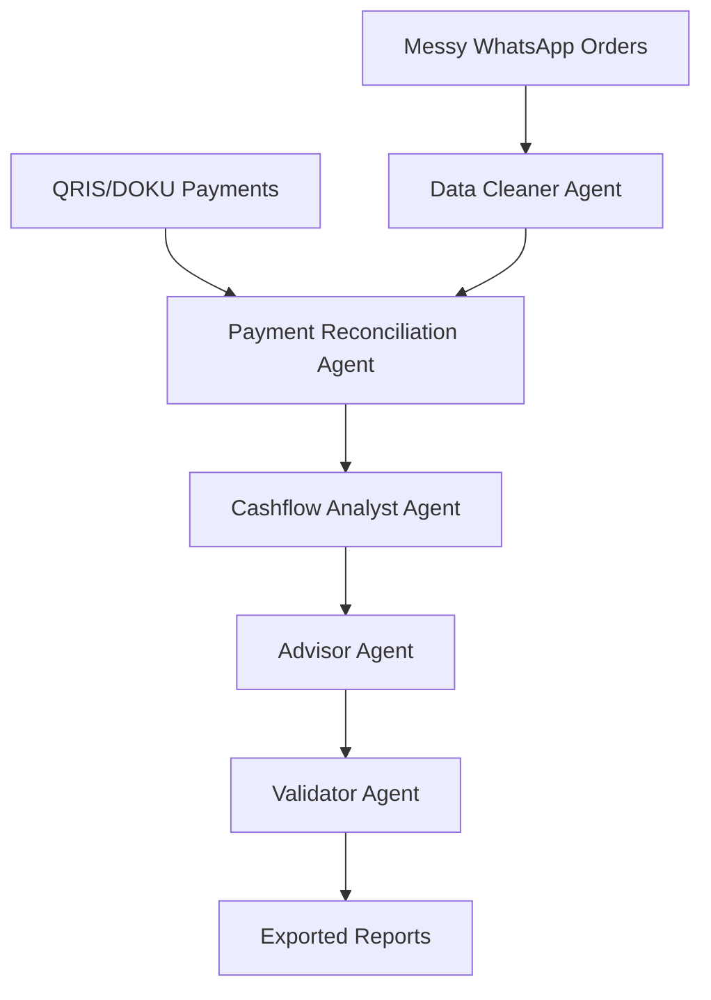

# WarungFlow

**Autonomous finance operations agent for Indonesian UMKM.**

**Team:** OpenClaw2026_MuhammadAldoFahrezy · **Repository:** OpenClaw2026_MuhammadAldoFahrezy_WarungFlow

WarungFlow is **deterministic-first**: even without an LLM key or DOKU credentials, the autonomous loop still calls tools, reconciles payments, calculates cashflow, validates outputs, and exports reports using local sample data.

## Problem Statement

Many Indonesian UMKM and warung owners receive orders through WhatsApp, accept payments through QRIS/bank transfer/cash, and track expenses manually. At the end of the day, they often do not know which customers have paid, which payments are partial, how much revenue came in, or what action they should take next. The manual process of matching WhatsApp chats to bank mutations is slow and error-prone.

## Solution Overview

WarungFlow solves this by acting as an autonomous finance operations agent. It parses messy order messages, reconciles payments deterministically, detects unpaid/partial payments, calculates daily cashflow, scores the business health, and optionally generates DOKU Sandbox payment links for unpaid orders.

## Why this is not a chatbot

WarungFlow is NOT a chatbot. It does not wait for a user's prompt. When triggered, it enters an autonomous loop, deciding which tool to call based on `AgentState`. It has tool-calling capabilities ("tangan"), memory, and a visible execution trace.

## OpenClaw workspace (agent brain)

Per competition mentor guidelines, the `workspace/` folder defines the agent for OpenClaw / QwenPaw:

| File | Purpose |
|------|---------|
| `AGENTS.md` | Multi-agent roles |
| `SOUL.md` | Product philosophy |
| `TOOLS.md` | Callable tools catalog |
| `HEARTBEAT.md` | Autonomous loop policy |
| `MEMORY.md` | State / memory model |
| `PROFILE.md` | Demo merchant + identity (QwenPaw) |
| `IDENTITY.md` / `USER.md` | Competition context |

Runtime code lives in `agents/` and `tools/`; `openclaw.json` links the workspace to the app.

## Agent workflow



## Installation

1. Create and activate a virtual environment:

```bash
python3 -m venv .venv
source .venv/bin/activate
```

**Windows (PowerShell or CMD):**

```bat
python -m venv .venv
.venv\Scripts\activate
```

2. Install dependencies:

```bash
pip install -r requirements.txt
```

3. Setup environment variables:

```bash
cp .env.example .env
```

Leave `LLM_MODE=mock` and `PAYMENT_MODE=mock` for judging without API keys.

## How to run tests

```bash
python smoke_test.py -v
python -m compileall app.py smoke_test.py config.py state.py agents tools dashboard.py
```

## How to run the app

```bash
streamlit run app.py
```

Click **Run WarungFlow Agent** once. The orchestrator autonomously loads sample data, parses orders, reconciles payments, generates reports, validates, and exports files to `outputs/`.

## Live deployment (Devpost bonus)

**VPS (this server):** http://43.157.208.68:8501 — see `deploy/start.sh` and **[DEPLOY.md](DEPLOY.md)**.

**Streamlit Cloud:** step-by-step in **[DEPLOY.md](DEPLOY.md)**.

1. Push `main` to https://github.com/aldofahrezy/Warung-Flow  
2. https://share.streamlit.io → Create app → `app.py`  
3. Paste secrets from `.streamlit/secrets.toml.example` (`PAYMENT_MODE=mock`)  
4. Add the `*.streamlit.app` URL to Devpost **Live Deployment Link**

Suggested app slug: `warungflow-muhammadaldofahrezy`

## Environment variables

See `.env.example`. DOKU keys are optional; missing credentials fall back to mock mode with a non-blocking warning.

```
DOKU_CLIENT_ID=dk_********1234
DOKU_SECRET_KEY=SK-********
DOKU_SANDBOX_BASE_URL=https://api-sandbox.doku.com
```

Never commit `.env`.

## Sample data (Warung Bu Sari)

- `data/sample_orders_whatsapp.txt` (10 orders)
- `data/sample_qris_transactions.csv`
- `data/sample_expenses.csv`
- `data/sample_customers.csv`
- `data/merchant_profile.json`
- `data/menu_price_catalog.json`

## Demo scenario

1. Open the UI (`streamlit run app.py`).
2. Confirm Mock Mode in the sidebar (or set `PAYMENT_MODE=mock` in `.env`).
3. Click **Run WarungFlow Agent**.
4. Review execution trace, reconciliation (PAID / UNPAID / PARTIAL / OVERPAID), reminders, health score, and downloads.

## Outputs

After a run, see `outputs/`:

- `daily_report.md`
- `payment_reminders.md`
- `financing_readiness.md`
- `validation_report.md`
- `reconciliation_result.csv`
- `execution_trace.csv`

## Submission assets

- Pitch deck source: `docs/OpenClaw2026_MuhammadAldoFahrezy_WarungFlow.md`
- Devpost copy: `docs/devpost_submission.md`
- Demo script: `docs/demo_script.md`
- Checklist: `SUBMISSION.md`

## Tech stack

- Python 3.11+
- Streamlit
- pandas
- python-dotenv
- RapidFuzz

## Known limitations

- Local files instead of live WhatsApp webhooks.
- DOKU Sandbox is optional and not live banking.

## AI tools/models used

- Cursor / Gemini-assisted development for agent loop structure and sample data.

## License

MIT (hackathon submission).
