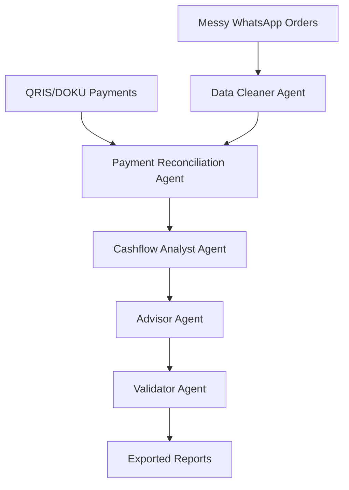

# OpenClaw2026_MuhammadAldoFahrezy_WarungFlow

**Team:** Muhammad Aldo Fahrezy · **Project:** WarungFlow

---

## Slide 1 — Problem Statement

- Indonesian UMKM and warung owners take orders via **WhatsApp**, accept **QRIS / transfer / cash**, and track expenses manually.
- At close of day they often cannot answer: who paid, who owes, partial payments, or net profit.
- Matching chat orders to bank mutations is slow, error-prone, and blocks financing conversations.

---

## Slide 2 — Solution Overview

- **WarungFlow** — autonomous finance operations agent for Indonesian UMKM.
- Tagline: *From messy notes to bankable reports, autonomously.*
- Parses WhatsApp orders, reconciles QRIS-style payments, flags issues, scores cashflow, generates reminders and financing-readiness summaries.
- **Not a chatbot:** one button runs a full autonomous tool loop.

---

## Slide 3 — AI Agent Workflow / Architecture

- **Orchestrator:** state-driven `decide_next_action()` loop (max 20 steps).
- **Memory:** `AgentState` + `execution_trace`.
- **Tools:** 18+ real Python tools (load, parse, reconcile, cashflow, validate, export).
- **DOKU Sandbox (optional):** payment requests with mock fallback.

---

## Slide 4 — Key Features & Tech Stack

| Feature | Benefit |
|---------|---------|
| QRIS-style reconciliation | Fuzzy names + order-ID priority in bank notes |
| Payment issues | UNPAID, PARTIAL, OVERPAID detection |
| Health score | 0–100 cashflow signal |
| Bahasa reminders | Actionable WhatsApp follow-ups |
| Mock mode | Runs without API keys |

**Stack:** Python 3.11+, Streamlit, pandas, rapidfuzz, python-dotenv, DOKU adapter.

---

## Slide 5 — Future Development / Impact

- WhatsApp Business API for live order intake.
- Live QRIS / DOKU webhook sync.
- POS integration and bank-ready ledger exports.
- **Impact:** financial inclusion and daily clarity for millions of UMKM.

---

*Export to PDF: `pandoc docs/OpenClaw2026_MuhammadAldoFahrezy_WarungFlow.md -o docs/OpenClaw2026_MuhammadAldoFahrezy_WarungFlow.pdf`*
